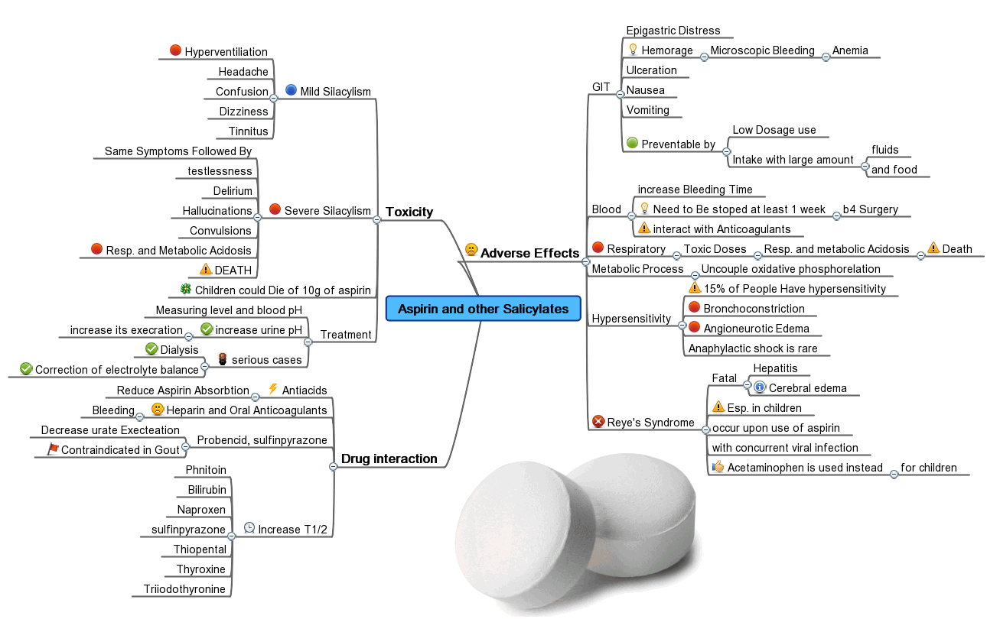

# Mind Maps

Mind maps help you to split a subject into topics and subtopics, laying it out in a tree-like structure. Each node is a topic that you could represent in a single word, clause, or a full sentence. You start with the subject of your mind map and think about ideas that you associate with it. Then you repeat it for the ideas that you have just written down. You will end up with a comprehensive representation of your project, from the very top view to minute details.

*By [Madhero88](https://en.wikipedia.org/wiki/User:Madhero88), licensed under CC BY 3.0*

Instead of just laying down topics, I prefer to mix the [right questions](./questions.md) with answers. This way I can always tell if I have exhausted any given topic: if I did, then there are no more questions to ask and no more answers to give. This also brings my mind closer to the mind of my reader, meaning that my mind map would reflect an appropriate documentation structure.

I did the following example for the Streams team. Here, I can easily draw two shapes: one would include contents for the welcoming page and the other for the contribution guidelines. Dashed lines would turn into references or hyperlinks. I can clearly see where I need the team's expertise to continue.

The following is what Jelle Millenaar from the Identity team had come up with when I first introduced this tool to him. In fifteen minutes, he paved a road from being a stranger to Identity to an obscure topic of verifiable presentations. He felt that verifiable credentials and its subtopics would require at least one separate article, so he had put this topic in bold.

As the mind map grows, it would help us to distribute the information between articles, arrange articles within the documentation site, and arrange content within the articles.

You could lay out a mind map on a sheet of paper or a whiteboard, but it can grow too big to fit, and you would have trouble communicating it remotely. Use [Miro](https://miro.com) instead. 

Do not bother thinking whenever you do it the right or the wrong way or if you list wrong topics. Whatever keeps you throwing topics on the board is right. Whatever slows you down is wrong. You can remove useless topics later, when there are no more topics left to add.