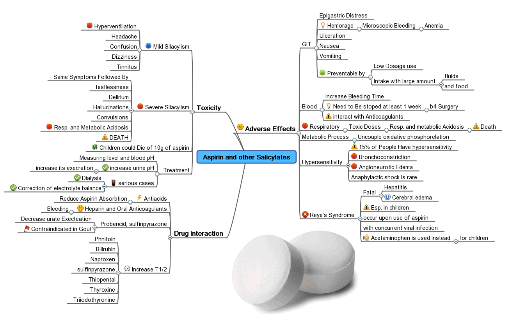

# Mind Maps

Each software project at IOTA is vast. It has a myriad of different aspects and features, each having a myriad of nuances and details to keep in mind. It takes a page after a page to explain the project in full. You have to plan the documentation beforehand to gauge the amount of work and decide what do you have to describe first. A clear picture will help.

A mind map splits a subject of study into separate ideas like topics, features, or aspects. Each idea is then split into more ideas on a more detailed level, until there is no reason to break ideas down any further. Take a look at the example below. Besides other properties, aspirin has a number of side effects. Namely, it thins your blood so you should be wary of using it with anticoagulants. You could go deeper and, say, describe how a doctor should adjust the dosage for different anticoagulants, but the author has decided against that level of detail.

*By [Madhero88](https://en.wikipedia.org/wiki/User:Madhero88), licensed under CC BY 3.0*

Mind map is a map of a mind and different people have different minds, so we dissect subjects in dissimilar ways. It is up to you to decide how do you use this tool. You could make a single giant map, or you could have several mind maps of separate topics. You could stick to a bigger picture or write down every minute detail. There are different perspectives, too. Do you describe your project's architecture, or the ways the users interact with it?

I prefer to mix the [right questions](./questions.md) with answers. It keeps information relevant to the reader and I can always tell if I have exhausted any given topic: if I did, then there are no more questions to ask and no more answers to give. I did the following example for the Streams team. 

The following is what Jelle Millenaar from the Identity team had come up with when I first introduced this tool to him. In fifteen minutes, he paved a road from being a stranger to Identity to an obscure topic of verifiable presentations. He felt that verifiable credentials and its subtopics would require at least one separate article, so he had put this topic in bold.

## How To Use It

You can scribble a quick mind map on a sheet of paper, but that would be awkward to edit later, it could grow too big, and you would have trouble discussing it in a call. [Miro](https://miro.com) has none of these issues, and has a built-in template for mind maps.

Do not bother thinking whenever you do it the right or the wrong way or if you list wrong topics. Whatever keeps you throwing topics on the board is right. Whatever slows you down is wrong. You can remove useless topics later, when there are no more topics left to add.

Mind maps merely represent a certain subject. They help you to think about the project and share your view with others, but they do not generate a documentation outline or content.